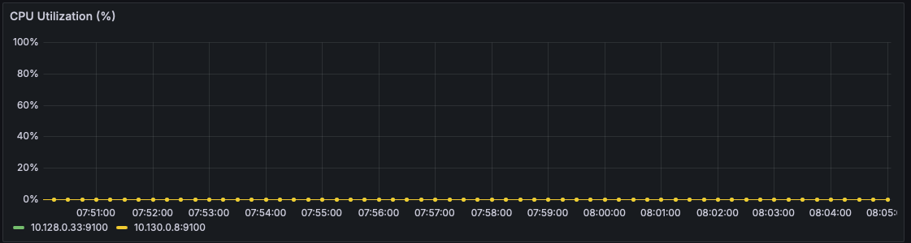
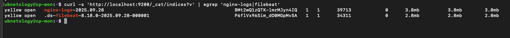

# HA-сайт в Yandex Cloud: ALB + 2 веб-ВМ (2 AZ) + мониторинг (Prometheus/Grafana)

## Краткое резюме
- **2 веб-ВМ** в разных зонах: одинаковый nginx + статика.
- **Балансировка**: Target Group → Backend Group (HC: `HTTP / :80`) → HTTP Router → **Application Load Balancer**.
- **Bastion/Monitoring-ВМ `cp-mon`** с **Prometheus** и **Grafana**; доступ снаружи ограничен Security Groups.
- На веб-ВМ установлены **node_exporter** и **nginxlog-exporter**; **Prometheus** собирает метрики; в **Grafana** настроены панели (CPU Utilization/Load, Web USE 2xx/4xx/5xx, RPS/size).

---

## Доступ / проверка
| Ресурс | URL/порт | Примечание |
|---|---|---|
| Сайт через ALB | `http://84.201.151.117/` | отдаёт статику с обоих веб-серверов |
| Prometheus | `http://89.169.145.165:9090/` | доступ ограничен SG (при необходимости — SSH-tunnel) |
| Grafana | `http://89.169.145.165:3000/` | доступ ограничен SG (при необходимости — SSH-tunnel) |

> SSH-tunnel пример:  
> `ssh -L 9090:localhost:9090 -L 3000:localhost:3000 ubnetology@89.169.145.165`

---

## Архитектура

        Internet
            |
[ ALB 84.201.151.117 ] :80
     /               \

ru-central1-a        ru-central1-d
[cp-web-a] 10.128.0.33  [cp-web-d] 10.130.0.8
nginx + exporters       nginx + exporters
9100 (node)             9100 (node)
4040 (nginx logs)       4040 (nginx logs)

         VPC (private)
             |

[cp-mon] 10.128.0.27 / 89.169.145.165
Prometheus :9090
Grafana    :3000

---

## Инвентарь ВМ
| Хост | Роль | Зона | Внутренний IP | Публичный IP |
|---|---|---|---|---|
| `cp-web-a` | nginx + exporters | ru-central1-a | 10.128.0.33 | — |
| `cp-web-d` | nginx + exporters | ru-central1-d | 10.130.0.8  | — |
| `cp-mon`   | Bastion + Prometheus + Grafana | ru-central1-a | 10.128.0.27 | 89.169.145.165 |

---

## Балансировщик
1. **Target Group**: `cp-web-a`, `cp-web-d`.  
2. **Backend Group**: backend → target group, **healthcheck**: `HTTP / :80`.  
3. **HTTP Router**: маршрут `/` → backend group.  
4. **ALB**: listener `auto:80`, подключён HTTP router.

Проверка:
```bash
curl -s http://84.201.151.117/ | head -5
for i in {1..6}; do curl -s http://84.201.151.117/ | grep '^<h1>'; done
# видно чередование: WEB: cp-web-a / WEB: cp-web-d


⸻

Security Groups (минимально необходимые)

sg-alb
	•	In: 80/tcp от 0.0.0.0/0 (публичный доступ к сайту).
	•	In: правила health-check от YC.

sg-web (на веб-ВМ)
	•	In: 80/tcp только от sg-alb.
	•	In: 22/tcp от sg-mon (bastion).
	•	In: 9100/tcp, 4040/tcp от sg-mon (Prometheus).
	•	Out: разрешён исходящий трафик (apt и пр.).

sg-bastion (sg-mon) (на cp-mon)
	•	In: 22/tcp только от доверенных IP оператора.
	•	In: 9090/tcp (Prometheus), 3000/tcp (Grafana) — только от доверенных IP или через SSH-tunnel.

⸻

Мониторинг

Экспортеры на веб-ВМ
	•	node_exporter слушает :9100
	•	prometheus-nginxlog-exporter слушает :4040, читает /var/log/nginx/access.log

Проверка с cp-mon:

curl -s 10.128.0.33:9100/metrics | head -3
curl -s 10.130.0.8:9100/metrics  | head -3

curl -s 10.128.0.33:4040/metrics | head -10
curl -s 10.130.0.8:4040/metrics  | head -10

Prometheus

Фрагмент prometheus/prometheus.yml:

scrape_configs:
  - job_name: 'node'
    static_configs:
      - targets: ['10.130.0.8:9100','10.128.0.33:9100']

  - job_name: 'nginx_logs'
    static_configs:
      - targets: ['10.130.0.8:4040','10.128.0.33:4040']

  - job_name: 'prometheus'
    static_configs:
      - targets: ['localhost:9090']

Проверка на cp-mon:

systemctl status prometheus --no-pager | sed -n '1,12p'
curl -s http://localhost:9090/-/ready
curl -s http://localhost:9090/api/v1/targets \
  | jq '.data.activeTargets[] | {scrapePool, scrapeUrl, health}' | head

Grafana
	•	Data source: Prometheus (http://localhost:9090) — OK.
	•	Дашборд Web Monitoring (ключевые панели):
	•	CPU Utilization (%) — 100 * rate(node_cpu_seconds_total{mode!="idle"}[5m]) / rate(node_cpu_seconds_total[5m]) (пороги 70/90).
	•	CPU Load (1m)/core — node_load1 / machine_cpu_cores (пороги 1/2).
	•	Web USE (RPS) — 2xx/4xx/5xx (stacked), легенды вида 2xx - {{instance}}.
	•	HTTP Response Size (B/s) — sum by(instance)(rate(nginx_http_response_size_bytes[1m])) (bytes/second).

Проверка на cp-mon:

systemctl status grafana-server --no-pager | sed -n '1,12p'
curl -s http://localhost:3000/api/health | jq .


⸻

Содержимое репозитория

.
├── exporters/
│   ├── node_exporter.service
│   ├── nginxlog-exporter.service
│   └── nginxlog-exporter-config.yml
├── grafana/
│   └── dashboards/
│       └── (JSON экспорт дашборда прилагается скриншотами)
├── nginx/
│   └── (статика сайта)
├── prometheus/
│   └── prometheus.yml
├── screenshots/
│   └── *.png (см. ниже)
└── README.md


⸻

## Логи: Elasticsearch + Filebeat + Kibana

### Схема
- **cp-mon**: Elasticsearch (single-node), Kibana.
- **cp-web-a / cp-web-d**: Filebeat читает `/var/log/nginx/{access,error}.log` и пишет в ES индекс `nginx-logs-*`.
- Доступ к Kibana открыт только с доверенного IP (SG). К ES (9200/tcp) разрешено только из `sg-web`.

### Конфигурация Filebeat (cp-web-a)
```yaml
filebeat.inputs:
  - type: filestream
    id: nginx_access
    enabled: true
    paths: ["/var/log/nginx/access.log"]
  - type: filestream
    id: nginx_error
    enabled: true
    paths: ["/var/log/nginx/error.log"]

output.elasticsearch:
  hosts: ["10.128.0.27:9200"]   # приватный IP cp-mon
  indices:
    - index: "nginx-logs-%{+yyyy.MM.dd}"

setup.ilm.enabled: false

---

## Скриншоты

### 1. Сайт через ALB отвечает


### 2. Конфигурация ALB/роутера/бэкендов (RR/HC)


### 3. Prometheus Targets: все up


### 4. Prometheus Graph: NGINX RPS из nginxlog-exporter


### 5. Grafana: обзор дашборда


### 6. Grafana: CPU Utilization (%)


### 7. Grafana: Web USE (2xx/4xx/5xx, rps)


### 8. Grafana: HTTP response size (bytes/sec)


### 9a. Security Group — bastion/monitoring


### 9b. Security Group — ALB


### 9c. Security Group — web


### 10. Список ВМ и зоны


### 11. CLI-пруф: Prometheus & Grafana активны


### 12. Grafana — Disk Saturation (I/O busy, %)


### 13. Grafana — RAM Saturation (major page faults/s)


### 14. Elasticsearch — Cluster health


### 15. Elasticsearch — список индексов (`/_cat/indices`)


### 16. Kibana — Home


### 17. Kibana — Data view `nginx-logs`


### 18. Kibana — Discover (`nginx-logs`, последние 15 минут)


### 19a. Filebeat на `cp-web-a` — OK


### 19b. Filebeat на `cp-web-d` — OK

